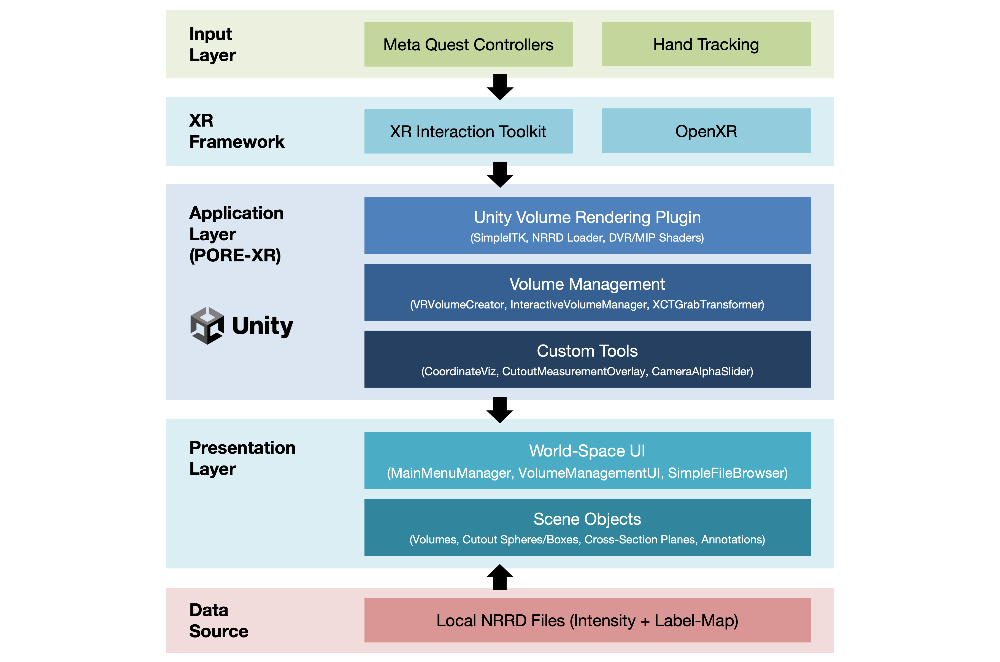
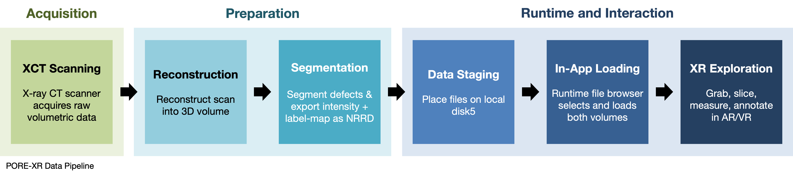

# PORE-XR

**P**orous **O**bjects **R**esearch & **E**xploration in **XR** (PORE-XR) is an immersive Extended Reality (XR) visualization platform for exploring large-scale X-ray Computed Tomography (XCT) datasets in materials science. The platform enables researchers, students, and industry practitioners to intuitively explore internal material structures, analyze defects such as porosity and cracks, and perform spatially correlated analysis in VR environments.

## Demo Video

---

## Table of Contents

- [Overview](#overview)
- [Key Features](#key-features)
- [Deployment Targets](#deployment-targets)
- [System Architecture](#system-architecture)
- [Data Pipeline](#data-pipeline)
- [Interaction & Analysis](#interaction--analysis)
- [Future Work](#future-work)
- [Getting Started](#getting-started)
- [Contributing](#contributing)
- [License](#license)
- [Contact](#contact)

---

## Overview

**X-ray Computed Tomography (XCT)** provides non-destructive insight into the internal structure of materials across multiple length scales. However, conventional visualization workflows limit intuitive spatial understanding due to their limitation to 2D cross-sectional analysis and Static 3D renderings on conventional displays. These constraints hinder:

- Intuitive spatial interpretation of pores and cracks
- Correlation of morphology with mechanical performance
- Collaborative exploration and teaching
- Interactive annotation and storytelling

**PORE-XR** transforms volumetric datasets into immersive, navigable environments, enabling researchers to explore XCT volumes and microstructural features, perform interactive 3D measurements, and conduct multi-scale analysis. The project is built in **Unity** and uses the [**Unity Volume Rendering**](https://github.com/mlavik1/UnityVolumeRendering) (also known as **EasyVolumeRendering**) open-source plugin as its core volume rendering backend, extended with custom scripts for XR interaction, UI, measurement overlays, and annotation tools. XR interaction is provided by the **XR Interaction Toolkit** with **OpenXR** support via PC Link. 

---

## Key Features

### Visualization
- Real-time volumetric rendering of XCT datasets  
- Support for segmentation overlays (pores, cracks, and regions of interest)  
- Dual-volume rendering with automatic alignment (intensity + label-map)  
- Multiple rendering modes and adjustable transfer functions  

### Interaction & Exploration
- Intuitive XR-based manipulation (grab, rotate, scale)  
- Interactive cutout tools (sphere and box) for localized inspection  
- Cross-section and slicing planes for internal exploration  
- Multi-scale navigation of volumetric data  

### Analysis & Annotation
- Real-time measurement overlays for cutout geometries  
- Coordinate readout in volume-local space  
- Persistent annotation and tagging capabilities  

### Data & Performance
- Runtime dataset loading via in-app file browser (NRRD support)  
- Adjustable sampling rate for performance–quality trade-offs  

### Platform Support
- Cross-platform deployment: VR, AR, and desktop  
- AR passthrough visualization with adjustable dimming  

---

## Deployment Targets

PORE-XR supports multiple deployment modes to accommodate a range of research, educational, and analysis workflows:

- **VR Mode**  
  Fully immersive environment for in-depth exploration, analysis, and teaching. Primary deployment targets Meta Quest devices via PC Link.

- **AR Mode**  
  Integrates volumetric data with real-world environments using passthrough, enabling contextual visualization alongside physical samples. Passthrough intensity can be adjusted for clarity.

- **Desktop Mode**  
  Non-immersive interface for data inspection, preprocessing, and general interaction without XR hardware.
  
---

## System Architecture

The PORE-XR system is composed of two primary stages: offline data preparation and real-time XR-based visualization and interaction.

### Data Preparation & Ingestion

**Offline Processing**
- Acquire raw XCT scan data from an X-ray CT scanner  
- Process and inspect volumes using tools such as **3D Slicer** (or similar scientific imaging software)  
- Segment defects (e.g., pores, cracks, regions of interest) to generate a label-map volume  
- Downsample or crop datasets to optimize memory usage and performance  
- Export intensity and label-map volumes as separate NRRD files  

**Runtime Loading**
- Select datasets via an in-app file browser  
- Load NRRD volumes using the **Unity Volume Rendering** framework with **SimpleITK** bindings  
- Asynchronously load intensity and label-map volumes with progress feedback  
- Automatically align and parent label-map volumes to the corresponding intensity volume  
- Configure label-map visualization (e.g., transfer function color) at runtime or via Inspector  

### Visualization & Interaction

- GPU-based volume rendering using Unity Volume Rendering (DVR, MIP, and surface modes)  
- Real-time interaction enabled by the XR Interaction Toolkit  
- Interactive analysis tools, including cutout primitives and cross-section planes  
- World-space UI (wrist-mounted and main menu) for dataset and tool management  
- Adjustable rendering quality via sampling-rate controls  
- Volume bounds visualization for improved spatial context  

---

## Data Pipeline

The data pipeline defines the end-to-end workflow from XCT acquisition to immersive analysis in XR:

1. **Data Acquisition**  
   Capture volumetric data using an X-ray CT scanner.

2. **Reconstruction & Formatting**  
   Reconstruct raw scan data and convert it into a standardized volumetric format (e.g., NRRD).

3. **Segmentation & Preparation**  
   Use tools such as **3D Slicer** to segment defects or regions of interest. Prepare datasets by downsampling or cropping as needed, and export both intensity and label-map volumes.

4. **Dataset Loading**  
   Import volumes into the application via the in-app file browser, loading the intensity volume followed by the corresponding label-map.

5. **Immersive Exploration & Analysis**  
   Explore and analyze the dataset in XR through direct manipulation, cross-sectional inspection, measurement, and annotation tools.
   
---

## Interaction & Analysis

PORE-XR provides a set of intuitive XR interaction and analysis tools for exploring and interrogating volumetric datasets in real time.

### Volume Manipulation (XR Interaction Toolkit)
- **Grab and move**: grip (side squeeze) on the right or left controller to grab and reposition the volume
- **Two-handed scale**: grab with both controllers simultaneously to scale the volume up or down
- **Y-axis locked rotation**: volume rotation is constrained so the object stays upright (local up = world up) via a custom `XCTGeneralGrabTransformer`
- **Snap turn and strafe**: standard locomotion; teleportation is disabled
- **Multi-volume targeting**: grabbing a volume automatically re-targets the wrist management menu to that volume

### Cutout and Cross-Section Tools (via wrist menu buttons)
- **Create cutout sphere**: spawns an interactive sphere cutout at the volume position; grabbable and scalable
- **Create cutout box**: spawns an interactive box cutout at the volume position; grabbable and scalable
- **Create cross-section plane**: spawns a slicing plane; grabbable and repositionable
- **Delete all cutout volumes / Delete all cross-sections**: bulk removal buttons on the wrist menu
- **Delete volume**: removes the currently targeted volume entirely

### Measurement Overlay (`CutoutMeasurementOverlay`)
- Automatically displays dimension labels on every active cutout sphere (diameter) and cutout box (side length if uniform, or W x H x D if not)
- Labels are billboarded toward the camera and update in real time as cutouts are moved/scaled

### Coordinate Visualization & Annotation (`CoordinateViz`)
- **Hold A** (right hand) or **X** (left hand): shows the controller's position as volume-local coordinates (poke-point style) in a billboarded text label
- **Press B** (right hand) or **Y** (left hand): places a persistent small sphere annotation at the current controller position, parented to the volume so it stays fixed in volume space when the volume is moved or scaled
- Targets the closest interactive volume automatically when multiple volumes are in the scene

### UI Controls
- **Main menu**: load dataset button with progress indicator, data quality slider (sampling-rate multiplier 0.2–1.0), AR passthrough dimming slider
- **Volume management wrist menu**: dataset name display, intensity visibility toggle, cutout/plane creation and deletion buttons

> **Performance Note**  
> Loading large dual-volume datasets can require substantial RAM. For smooth demos, prefer machines with ample memory (32 GB+) and a VR capable GPU with ample video memory(12+).

---

## Future Work
Planned extensions aim to expand PORE-XR’s analytical capabilities, scalability, and collaborative potential:
- **Temporal XCT visualization**
  Support for time-resolved datasets to analyze dynamic processes such as crack initiation and propagation
- **AI-assisted defect analysis**
  Integration of machine learning pipelines for automated detection, segmentation, and classification of defects
- **Collaborative XR environments**
  Multi-user sessions enabling shared exploration, annotation, and discussion in real time
- **Advanced export workflows**
  Tools for generating publication-ready visuals, annotated datasets, and analysis outputs
- **Digital twin integration**
  Coupling volumetric data with simulation and sensor data for comprehensive digital twin frameworks
- **More Customizable Import Pipeline**
  Ability to import multiple labelmap volumes and more manipulation controls for viewing volumes
---

## Getting Started

### Prerequisites

- Unity (version matching the `Packages/manifest.json` in this repository)
- An OpenXR compatible headset (A Meta Quest headset + Quest Link is preferred, which was used during development)
- PC with 32 GB+ RAM recommended for large datasets

### Setup

1. Clone or download this repository.
2. Open the project in Unity and let packages resolve (XR Interaction Toolkit, OpenXR, Meta XR, Input System, UniTask).
3. Retrieve large external files from Dropbox and place them in the expected project locations:
   - **Project dependencies and binaries** (includes `SimpleITKCSharpNative.dll` → place at `Assets/EasyVolumeRendering/Assets/3rdparty/SimpleITK/`):  
     [Dropbox — Dependencies](https://www.dropbox.com/scl/fo/pzecwwg8hzxrfcv9zb0ms/ACQ3zdY-qxeGJpXbCiwv6Mk?rlkey=62agqxpy9n17z85w0qvr76z3v&st=bl8fwx0d&dl=0)
   - **Sample XCT data files** (`.nrrd` / `.uint16`):  
     [Dropbox — Data](https://www.dropbox.com/scl/fo/53olchkhmcl4tal47ow37/ADRFgJBi4xRgooVi3kt94rM?rlkey=n4gdgyc7ppbtycc2i8fwnyifo&st=m0iuiv9h&dl=0)
4. Place required binaries/data at expected project/runtime locations.
5. Connect Quest headset via Link, enter Play mode, and use the in-app file browser to select and load datasets (intensity and 
label-map files)

### In-Headset Controls Summary

| Action | Controller Input |
|---|---|
| Grab / move volume or cutout | Grip (side squeeze) |
| Two-handed scale | Grip with both hands simultaneously |
| Show live coordinates | Hold A (right) or X (left) |
| Place annotation sphere | Press B (right) or Y (left) |

---

## Contributing

We welcome contributions that improve functionality, performance, and usability. To contribute:

1. Fork the repository and create a dedicated feature branch.  
2. Adhere to the existing code style and project structure.  
3. Test all changes thoroughly, including in VR (Meta Quest via PC Link) when applicable.  
4. Avoid committing large binary files (e.g., datasets, native DLLs); instead, add them to `.gitignore` and distribute via approved external storage.  
5. Submit a pull request with a clear description of the changes, rationale, and any relevant testing details.  

Please ensure contributions are well-documented and aligned with the project’s research objectives.

---

## License

This project is developed for research purposes at the Georgia Institute of Technology. A formal license has not yet been established. Until then, all rights are reserved.  EasyVolumeRendering is licensed under MIT license requirements.
> Please contact the project team prior to any redistribution, modification, or use in commercial projects.
---

## Contact

This project is developed by the [Symbiotic and Augmented Intelligence Laboratory (SAIL)](https://sail.coe.gatech.edu/) at the Georgia Institute of Technology.

For inquiries related to the project, datasets, or potential collaborations, please contact:

- **Pantea Habibi** — [phabibi6@gatech.edu](mailto:phabibi6@gatech.edu)  
- **Dylan Alter** — [dylan@wolfstaginteractive.com](mailto:dylan@gwolfstaginteractive.com), Website: (https://www.wolfstaginteractive.com/)  
- **Mohsen Moghaddam** — [mohsen.moghaddam@gatech.edu](mailto:mohsen.moghaddam@gatech.edu)  

We welcome collaboration opportunities from academic, industry, and research partners.
