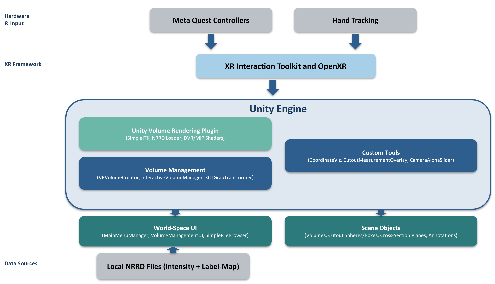
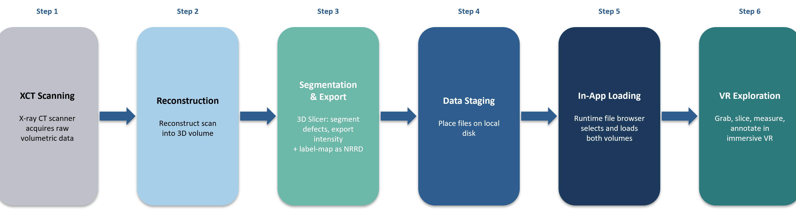

# PORE-XR

**P**orous **O**bjects **R**esearch & **E**xploration in **XR** (PORE-XR) is an immersive Extended Reality (XR) visualization platform for exploring large-scale X-ray Computed Tomography (XCT) datasets in materials science. The platform enables researchers, students, and industry practitioners to intuitively explore internal material structures, analyze defects such as porosity and cracks, and perform spatially correlated analysis in VR environments.

> _[Demo Video Placeholder]_

> _[Screenshots / GIF Placeholder]_

---

## Table of Contents

- [Overview](#overview)
- [Problem Statement](#problem-statement)
- [Proposed Solution](#proposed-solution)
- [Key Features](#key-features)
- [System Architecture](#system-architecture)
- [Data Pipeline](#data-pipeline)
- [Interaction and Analysis Tools](#interaction-and-analysis-tools)
- [Deployment Targets](#deployment-targets)
- [Extensions / Future Work](#extensions--future-work)
- [Getting Started](#getting-started)
- [Repository Structure](#repository-structure)
- [Roadmap](#roadmap)
- [Contributing](#contributing)
- [License](#license)
- [Contact](#contact)

---

## Overview

X-ray Computed Tomography (XCT) provides non-destructive insight into the internal structure of materials across multiple length scales. However, conventional visualization workflows limit intuitive spatial understanding.

**PORE-XR** transforms volumetric datasets into immersive, navigable environments that enable researchers to explore microstructural features and perform measurements in 3D space.

The project is built in **Unity** and uses the [**Unity Volume Rendering**](https://github.com/mlavik1/UnityVolumeRendering) (also known as **EasyVolumeRendering**) open-source plugin as its core volume rendering backend, extended with custom scripts for XR interaction, UI, measurement overlays, and annotation tools. XR interaction is provided by the **XR Interaction Toolkit** with **OpenXR** support via PC Link.

---

## Problem Statement

Current XCT data exploration workflows are typically limited to:

- 2D cross-sectional analysis
- Static 3D renderings on conventional displays

These constraints hinder:

- Intuitive spatial interpretation of pores and cracks
- Correlation of morphology with mechanical performance
- Collaborative exploration and teaching
- Interactive annotation and storytelling

There is a need for a high-performance immersive XR framework purpose-built for materials science that supports:

- Large-scale volumetric rendering
- Real-time interaction
- Cross-platform accessibility

---

## Proposed Solution

PORE-XR is designed as an interactive XR visualization platform that enables:

- Exploration of XCT volumes in immersive environments
- Real-time interaction
- Multi-scale navigation and exploration for basic analysis

The platform targets research, education, and industrial materials characterization workflows.

---

## Key Features

- Real-time volumetric rendering of XCT datasets
- Segmentation visualization for pores, cracks, and regions of interest
- Dual-volume loading: intensity volume + label-map overlay (automatically parented in-scene)
- Interactive cutout tools (sphere and box) and cross-section slicing planes
- Basic measurement information overlays for cutout volumes (dimensions displayed at each cutout)
- Coordinate readout and tagging ability in volume-local space
- Toggleable visualization layers (intensity visibility, label-map color)
- Runtime quality control via sampling-rate multiplier slider
- In-app file browser for selecting and loading NRRD dataset files at runtime
- AR passthrough dimming slider
- Cross-platform deployment (VR / AR / Desktop)

---

## System Architecture



### Data Ingestion & Pre-Processing

**Off-line preparation (before the app):**
- Acquire raw XCT scan data from an X-ray CT scanner
- Open the raw data in a tool such as **3D Slicer** (or similar medical/scientific imaging software) to inspect, segment, and prepare volumes
- Segment defects (pores, cracks, regions of interest) to produce a label-map volume
- Downsample or crop as needed to manage file size and memory requirements
- Export the intensity volume and the label-map volume as separate NRRD files
- Place the exported files on an accessible storage location.

**In-app loading (at runtime):**
- In-app file browser (SimpleFileBrowser) for runtime dataset selection
- NRRD-format loading pipeline powered by the **Unity Volume Rendering** plugin with **SimpleITK** native bindings
- User selects intensity file first, then label-map; both are loaded asynchronously with a progress indicator on the main menu
- Label-map volume is automatically parented under the intensity volume with zeroed local transform
- Label-map transfer-function color is configurable in the Inspector (default red)

### Visualization & Rendering

- Unity-based rendering framework using **Unity Volume Rendering** shaders (DVR / MIP / surface modes)
- Real-time volume rendering with XR Interaction Toolkit manipulation
- Cutout sphere, cutout box, cross-section plane, and slicing plane tools from the plugin, extended with XR grab interactivity
- World-space hand/wrist menu UI for volume management (create/delete cutouts and planes, toggle visibility, delete volume)
- Main menu with dataset quality slider and file loading controls
- Volume bounds wireframe visualization for spatial readability

---

## Data Pipeline



Typical end-to-end workflow:

1. **XCT data acquisition** — scan the physical sample with an X-ray CT scanner
2. **Reconstruction & conversion** — reconstruct the scan and convert to an open volumetric format (e.g. NRRD)
3. **Segmentation & export** — open in 3D Slicer (or similar tool), segment defects / regions of interest into a label-map, downsample if needed, and export intensity + label-map as separate NRRD files
4. **Launch app & load** — open the VR application, use the in-app file browser to select the intensity file first, then the label-map
5. **Immersive exploration** — interact in VR: grab/rotate/scale volumes, create cutout spheres/boxes and cross-section planes, adjust quality, read coordinates, and place annotation tags

---

## Interaction & Analysis Tools

### Volume Manipulation (XR Interaction Toolkit)
- **Grab and move**: grip (side squeeze) on the right or left controller to grab and reposition the volume
- **Two-handed scale**: grab with both controllers simultaneously to scale the volume up or down
- **Y-axis locked rotation**: volume rotation is constrained so the object stays upright (local up = world up) via a custom `XCTGeneralGrabTransformer`
- **Snap turn and strafe**: standard locomotion; teleportation is disabled
- **Multi-volume targeting**: grabbing a volume automatically re-targets the wrist management menu to that volume

### Cutout and Cross-Section Tools (via wrist menu buttons)
- **Create cutout sphere**: spawns an interactive sphere cutout at the volume position; grabbable and scalable
- **Create cutout box**: spawns an interactive box cutout at the volume position; grabbable and scalable
- **Create cross-section plane**: spawns a slicing plane; grabbable and repositionable
- **Delete all cutout volumes / Delete all cross-sections**: bulk removal buttons on the wrist menu
- **Delete volume**: removes the currently targeted volume entirely

### Measurement Overlay (`CutoutMeasurementOverlay`)
- Automatically displays dimension labels on every active cutout sphere (diameter) and cutout box (side length if uniform, or W x H x D if not)
- Labels are billboarded toward the camera and update in real time as cutouts are moved/scaled

### Coordinate Visualization & Annotation (`CoordinateViz`)
- **Hold A** (right hand) or **X** (left hand): shows the controller's position as volume-local coordinates (poke-point style) in a billboarded text label
- **Press B** (right hand) or **Y** (left hand): places a persistent small sphere annotation at the current controller position, parented to the volume so it stays fixed in volume space when the volume is moved or scaled
- Targets the closest interactive volume automatically when multiple volumes are in the scene

### UI Controls
- **Main menu**: load dataset button with progress indicator, data quality slider (sampling-rate multiplier 0.2–1.0), AR passthrough dimming slider
- **Volume management wrist menu**: dataset name display, intensity visibility toggle, cutout/plane creation and deletion buttons

> **Performance Note**  
> Loading large dual-volume datasets can require substantial RAM. For smooth demos, prefer machines with ample memory (32 GB+).

---

## Deployment Targets

- **VR Mode**  
  Full immersion for research exploration and teaching modules. Primary deployment: Meta Quest via PC Link.

- **AR Mode**  
  Overlay volumetric data onto physical samples or laboratory environments via passthrough. Passthrough dimming is adjustable.

- **Desktop Mode**  
  Non-immersive interaction for analysis and preprocessing.

---

## Extensions / Future Work

- Temporal XCT visualization for crack growth studies
- AI-based defect classification pipelines
- Multi-user collaborative XR sessions
- Export workflows for publication-ready annotated datasets
- Digital twin integration

---

## Getting Started

### Prerequisites

- Unity (version matching the `Packages/manifest.json` in this repository)
- Meta Quest headset + Quest Link (for VR testing)
- PC with 32 GB+ RAM recommended for large datasets

### Setup

1. Clone or download this repository.
2. Open the project in Unity and let packages resolve (XR Interaction Toolkit, OpenXR, Meta XR, Input System, UniTask).
3. Retrieve large external files from Dropbox and place them in the expected project locations:
   - **Project dependencies and binaries** (includes `SimpleITKCSharpNative.dll` → place at `Assets/EasyVolumeRendering/Assets/3rdparty/SimpleITK/`):  
     [Dropbox — Dependencies](https://www.dropbox.com/scl/fo/pzecwwg8hzxrfcv9zb0ms/ACQ3zdY-qxeGJpXbCiwv6Mk?rlkey=62agqxpy9n17z85w0qvr76z3v&st=bl8fwx0d&dl=0)
   - **Sample XCT data files** (`.nrrd` / `.uint16`):  
     [Dropbox — Data](https://www.dropbox.com/scl/fo/53olchkhmcl4tal47ow37/ADRFgJBi4xRgooVi3kt94rM?rlkey=n4gdgyc7ppbtycc2i8fwnyifo&st=m0iuiv9h&dl=0)
4. Place required binaries/data at expected project/runtime locations.
5. Connect Quest headset via Link, enter Play mode, and use the in-app file browser to select and load datasets (intensity and 
label-map files)

### In-Headset Controls Summary

| Action | Controller Input |
|---|---|
| Grab / move volume or cutout | Grip (side squeeze) |
| Two-handed scale | Grip with both hands simultaneously |
| Show live coordinates | Hold A (right) or X (left) |
| Place annotation sphere | Press B (right) or Y (left) |

---

## Repository Structure
```
PORE-XR/
├── Assets/
│   ├── Scripts/
│   ├── Prefabs/
│   └── ... (Unity assets, scenes, samples)
├── Packages/
├── ProjectSettings/
└── README.md
```

---

## Roadmap

- Initial prototype visualization
- Multimodal alignment validation
- Performance optimization phase
- User testing with materials researchers
- AI integration module
- Public research release

---

## Contributing

1. Fork the repository and create a feature branch.
2. Follow the existing code style and project structure.
3. Test changes in VR (Meta Quest via PC Link) before submitting.
4. Do **not** commit large binary files (datasets, native DLLs) — add them to `.gitignore` and distribute via the shared folder.
5. Open a pull request with a clear description of what changed and why.

---

## License

This project is developed for research purposes at Georgia Institute of Technology. License terms are to be determined. Please contact the team before redistributing or using in external projects.

---

## Contact

SAIL (https://sail.coe.gatech.edu/) at Georgia Institute of Technology

- Mohsen Moghaddam
- Pantea Habibi
- Dylan Alter

For questions about the project, datasets, or collaboration, please reach out to the team.
